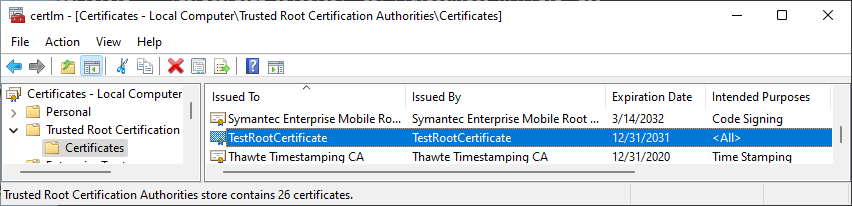
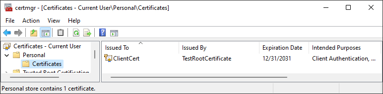
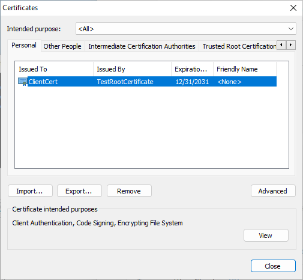
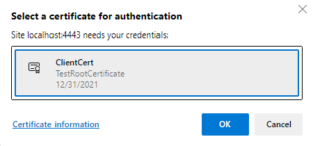
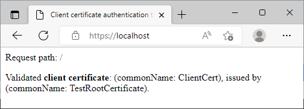

Example of how to use client certificates for web authentication. The examples are geared towards Windows, but all principles also apply to other operating systems.


## Getting started instructions

Prerequisites:
* Windows computer
* [Visual Studio](https://visualstudio.microsoft.com/) - for certificate generation command-line tools
* [Git](https://git-scm.com/) for Windows - for OpenSSL that is required for server certificate generation
* [Python](https://www.python.org/) - to run the test web server

### Generate certificates for testing (optional)
Test certificates are already added to the `TestCertificates` folder. These can be re-generated by running the `GenerateCertificates.bat` script from a developer command prompt.


### Install root certificate (optional)
This step will remove the "Not secure" warning when testing from a web browser.


Install the root certificate:
* Either: From an admin command prompt: `certutil –addstore –f "root" TestRootCertificate.cer`
* Or: Double-click on `TestRootCertificate.cer`, select "Install Certificate", select "Local Machine" as store location, then "Trusted Root Certificate Authorities" as store location. 

The root certificate will now show up in the Windows "Manage computer certificates" window:

 


### Install client certificate
This step will enable the web browser to use the client certificate for authentication against the server.

Install the client certificate:
* Either: Double-click on `ClientCert.pfx`, select "Install Certificate", select "Current User" as store location, then install with default settings.
* Or: From the web browser "Manage certificates" menu: Import `ClientCert.pfx` into "Personal" certificate store with default settings.

The client certificate will now show up in the Windows "Manage user certificates" window:

 

It will also show up in the web browser certificate dialogs:

 


## Web server testing
Double-click on `WebServer.py` to start the test web server.

### Testing from web browser
Steps:
* Open https://localhost:4443/ in a web browser.
* Select `ClientCert` in the certificate selection menu.



* Observe that the selected certificate is listed in the generated webpage.



### Testing from Python script
Steps:
* From a command prompt, run `python WebClient.py` to perform a programmatic HTTPS request
* Observe successful client certificate authentication in the response:
```
<html><head><title>Client certificate authentication test</title></head><body><p>Request path: /</p>
<p>Validated <b>client certificate</b>: (commonName: ClientCert), issued by (commonName: TestRootCertificate).</p></body></html>
```

## Code signing
Is't also possible to use the client certificate for code signing.

How to sign a binary:
* From a developer command prompt, run `signtool sign /a <FileName>.exe`
