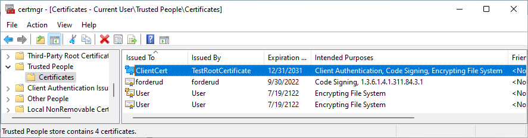
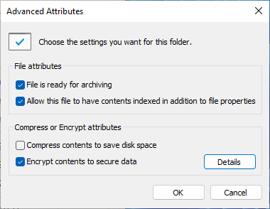
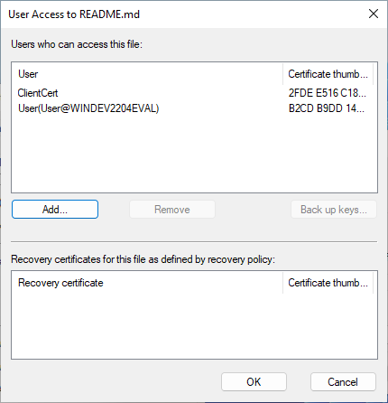

Example of how to use certificates for client authentication in web and TLS socket scenarios. The examples are geared towards Windows, but all principles also apply to other operating systems.


## Getting started instructions

Prerequisites:
* Windows computer
* [Visual Studio](https://visualstudio.microsoft.com/) - for certificate generation command-line tools
* [Git](https://git-scm.com/) for Windows - for OpenSSL that is required for server certificate generation
* [Python](https://www.python.org/) - to run the test web server

### Generate certificates for testing (optional)
Test certificates are already added to the `TestCertificates` folder. These can be re-generated by running the `GenerateCertificates.bat` script from a developer command prompt.


### Install root certificate (optional)
This step will remove the "Not secure" warning when testing from a web browser.


Install the root certificate:
* Either: From an admin command prompt: `certutil –addstore –f "root" TestRootCertificate.cer`
* Or: Double-click on `TestRootCertificate.cer`, select "Install Certificate", select "Local Machine" as store location, then "Trusted Root Certificate Authorities" as certificate store.

The root certificate will now show up in the Windows "Manage computer certificates" window:

 


### Install client certificate
This step will enable the web browser to use the client certificate for authentication against the server.

Install the client certificate:
* Either: From a command prompt: `certutil -user –importpfx ClientCert.pfx NoRoot,NoExport` (empty password)
* Or: Double-click on `ClientCert.pfx`, select "Install Certificate", select "Current User" as store location, then install with default settings.
* Or: From the web browser "Manage certificates" menu: Import `ClientCert.pfx` into "Personal" certificate store with default settings.

The client certificate will now show up in the Windows "Manage user certificates" window:

 

It will also show up in the web browser certificate dialogs:

 


## Client authentication
The `clientAuth` OID (1.3.6.1.5.5.7.3.2) EKU field in the client certificate enables it to be used for client authentication.
Double-click on `WebServer.py` to start the test web server to be used for testing of client authentication.

### Testing from web browser
Steps:
* Open https://localhost:4443/ in a web browser.
* Select `ClientCert` in the certificate selection menu.


* Observe that the selected certificate is listed in the generated webpage.


### Testing from Python
Steps:
* From a command prompt, run `python WebClient.py` to perform a programmatic HTTPS request
* Observe successful client certificate authentication in the response:
```
<html><head><title>Client certificate authentication test</title></head><body><p>Request path: /</p>
<p>Validated <b>client certificate</b>: (commonName: ClientCert), issued by (commonName: TestRootCertificate).</p></body></html>
```

### Testing from C#
Steps:
* Open and build the `WebClientNet` C# project in Visual Studio.
* Run the application and observe successful client certificate authentication in the response:
```
My client certificates:
* Certificate: CN=ClientCert
<html><head><title>Client certificate authentication test</title></head><body><p>Request path: /</p><p>Validated <b>client certificate</b>: (commonName: ClientCert), issued by (commonName: TestRootCertificate).</p></body></html>
```

## Code signing
The `codeSigning` OID (1.3.6.1.5.5.7.3.3) EKU field in the client certificate enables it to be used for code signing.

How to sign a binary:
* From a developer command prompt, run `signtool sign /a <FileName>.exe`

## NTFS file encryption
The `Encrypting File System` OID (1.3.6.1.4.1.311.10.3.4) EKU field in the client certificate enables it to be used for filesystem-based file encryption if the certificate is (also)  installed to the "Trusted People" folder in certificate manager.

Steps:
* Install `ClientCert.pfx` to the "Current User" " Trusted People" certificate store with default settings.



* Right-click on the desired file, select "Properties", then click on the "Advanced" button.
* Check the "Encrypt content to secure data" checkbox. Then click "OK" to encrypt the file.



* Reopen the "Advanced" dialog and click "Details", then click on "Add" to add "ClientCert" as certificate used for encryption.


